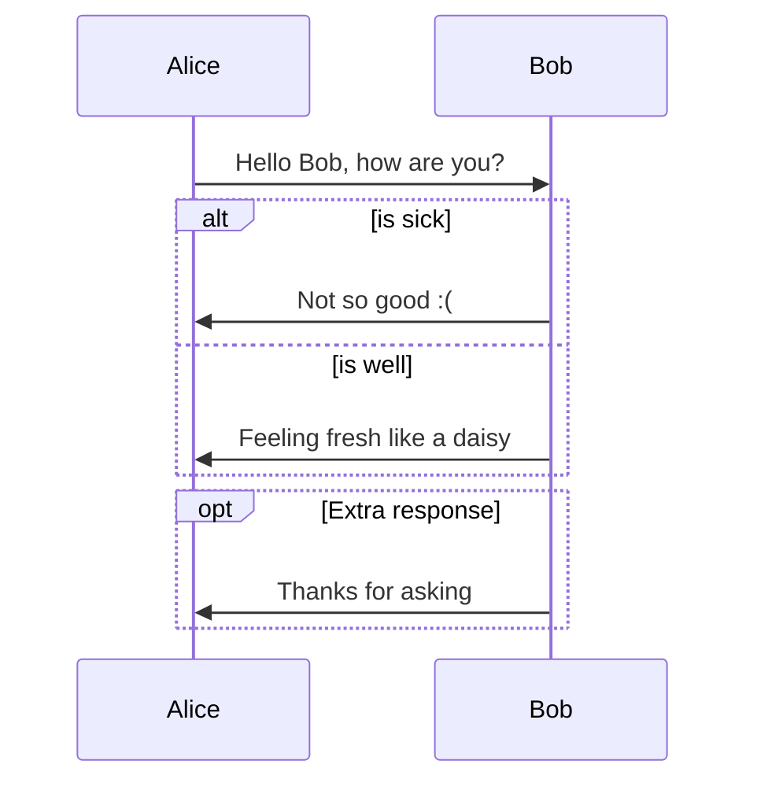

# Documentation Technique – Projet DevOps Cloud Azure

## Introduction

### Contexte

Ce projet a été réalisé pour accompagner un étudiant en Bac+5 dans le cadre de son projet de fin d’année en DevOps. L’objectif était de mettre en place une chaîne complète d’intégration et de déploiement continu (CI/CD) en exploitant les outils modernes du Cloud et de l’automatisation.

### Objectif

Prendre une application existante et construire une infrastructure DevOps permettant :
- Le déploiement automatique sur Azure
- L’automatisation des tests et du build
- L’utilisation de conteneurs pour assurer portabilité et rapidité de déploiement

### Environnement utilisé

- Cloud : Azure
- IaC : Terraform
- CI/CD : Jenkins
- Conteneurisation : Docker & Docker Compose
- Versioning : Git & GitHub
- Application : App JavaScript (Node.js + MySQL)
  
## Architecture globale

### Description

- Une VM Ubuntu Spot déployée sur Azure via Terraform
- Réseau : VNet public (NSG ouvert sur tous les ports, car projet de test uniquement)
- Logiciels installés automatiquement (cloud-init) : Docker, Apache2, Jenkins
- Pipeline Jenkins déclenché via webhook GitHub → build + tests + déploiement de l’application dans des conteneurs Docker
- Application exposée sur le port 3000 (frontend + backend + MySQL en conteneurs)
- Jenkins accessible sur le port 8080
- Apache2 sur le port 80 (utilisé pour récupérer le mot de passe Jenkins sans SSH)

### Schéma d’architecture (vue simplifiée)



## Prérequis

### Techniques

- Azure Subscription + Resource Group
- VM Ubuntu 22.04 LTS (image gen2)
- Terraform > v3.0
- Docker & Docker Compose
- Jenkins
- GitHub repository avec fichiers :
  - `Dockerfile`
  - `docker-compose.yml`
  - `Jenkinsfile`
  - `cloud-init.yaml` (installation auto : Docker, Jenkins, Apache2)

### Accès

- Rôle Contributor ou Owner sur Azure
- Accès au repo GitHub

## Infrastructure as Code (Terraform)

### Objectif

Créer automatiquement l’infrastructure sur Azure.

### Fichiers

- `main.tf` : définition des ressources Azure (VM, VNet, NSG)
- `variables.tf` : paramètres (VM size, mots de passe, etc.)
- `cloud-init.yaml` : script d’initialisation de la VM (Docker, Jenkins, Apache2)
  
### Procédure

```
az login
terraform init
terraform plan
terraform apply
```

## Jenkins (CI/CD)

### Installation / Configuration

1. Accéder à Jenkins via `http://<public_ip>:8080`
2. Récupérer le mot de passe admin (affiché par Apache sur port 80)
3. Installer les plugins recommandés + **Git Server**
4. Créer un compte admin
5. Ajouter les credentials GitHub (via un token PAT)
6. Configurer le Webhook GitHub → `http://<public_ip>:8080/github-webhook/`

### Pipeline (extrait du Jenkinsfile)

```
pipeline {
    agent any
    environment {
        APP_PORT = "3000"
        VM_IP = "xx.xx.xx.xx"
    }
    stages {
        stage('Checkout & Setup') { steps { git url: 'https://github.com/stanilpaul/docker-getting-started-devops-enhanced.git', branch: 'main' } }
        stage('Build & Test') { steps { sh 'docker-compose up -d && sleep 15 && docker-compose exec app yarn test || true && docker-compose down' } }
        stage('Deploy') { steps { sh 'docker-compose up -d && sleep 5 && curl -I http://localhost:${APP_PORT} || true' } }
    }
    post {
        success { echo "✅ Application déployée sur http://${VM_IP}:${APP_PORT}" }
        failure { echo "❌ Échec - vérifier logs" }
    }
}

```

## Docker

### Dockerfile

```
FROM node:18-alpine
WORKDIR /app
COPY package.json yarn.lock ./
RUN yarn install --frozen-lockfile --production
COPY . .
CMD ["node", "src/index.js", "--host", "0.0.0.0"]
EXPOSE 3000

```

### Docker Compose

```
services:
  app:
    build: .
    ports:
      - "3000:3000"
    environment:
      MYSQL_HOST: mysql
      MYSQL_USER: root
      MYSQL_PASSWORD: secret
      MYSQL_DB: todos
  mysql:
    image: mysql:8.0
    environment:
      MYSQL_ROOT_PASSWORD: secret
      MYSQL_DATABASE: todos
    volumes:
      - todo-mysql-data:/var/lib/mysql
volumes:
  todo-mysql-data:

```

## Application

* Repo : [docker/getting-started-app](https://github.com/docker/getting-started-app?utm_source=chatgpt.com)
* Techno : JavaScript (Node.js) – 92.8%, HTML 4.4%, CSS 2.8%
* Ports : 3000 (app), 8080 (Jenkins), 80 (Apache2 helper)
* Tests : lancer `docker ps` → 2 conteneurs actifs (app + MySQL). Vérifier via navigateur : `http://<public_ip>:3000`

## Sécurité

⚠️ Ce projet est une démo/test, mais pour une vraie production :
- Restreindre les règles NSG (ne pas laisser tous les ports ouverts)
- Ne pas stocker de mots de passe dans `variables.tf` → utiliser `terraform.tfvars` ou Azure Key Vault
- Déplacer le state file Terraform vers un backend sécurisé (Azure Storage)

## Procédures opérationnelles

- Déploiement manuel : si Jenkins tombe → `terraform destroy` puis `terraform apply`
- Relancer Docker : `docker-compose down && docker-compose up -d`
- Rollback : revenir à une version antérieure via GitHub
- Supervision : Azure Monitor / Log Analytics. Optionnellement exporter vers Grafana

## Annexes

- [Azure Portal](https://portal.azure.com/)
- [Terraform](https://developer.hashicorp.com/terraform)
- [Jenkins](https://www.jenkins.io/)
- [Repo GitHub Projet](https://github.com/stanilpaul/docker-getting-started-devops-enhanced)
- [Application d’origine](https://github.com/docker/getting-started-app)